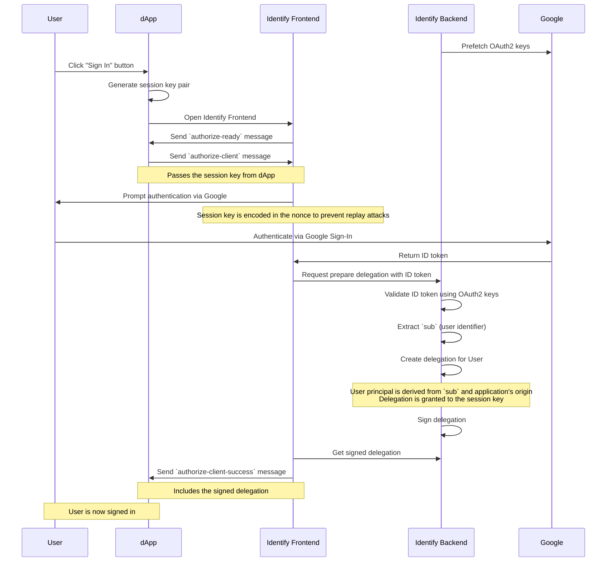

# Identify

Identify is an authentication provider for the Internet Computer, providing an endpoint for the standard authentication client to request Sign In with Google.

It also lets whitelisted apps look up the email address for a specific principal.

# Integration

## Managed setup

To integrate Identify into your own app, you just have to point the auth-client to one of the supported login urls.

- Integrate the auth-client into your app.
- Instead of "identity.ic0.app" point the auth client to one of the public instances of Identify (e.g. "https://login.f0i.de").

## Self deployed

Follow this steps if you want full control over the login process.

- deploy the canister on the IC
- Set up a custom domain. This should be a subdomain where you have control over the "top-level private domain", so you can create a google client id for it.
- Configure the canister to use the client ID
- Periodically update the google public keys
- Follow the same steps as for the section [Managed Setup](#Managed-Setup) to configure the auth-client

# Apps that use Identify

## Bitcoin Gift Cards

https://btc-gift-cards.com

## login.f0i.de

This app shows some basic statistics about how many apps are connected and how many users signed in with Identify.

# Development

## Contribution

You are welcome to submit any issues you have.
For PRs, please contact me in advance.

## Testing

Unfortunately the test require some differnt features that cause them to require different execution modes.
You can run all of them using the following commands.

```
mops test --mode wasi base64 jwt leb128 stats
mops test --mode interpreter delegation ed25519
```

# Authentication flow

1. **Identify Backend** pre-fetches OAuth2 keys from **Google server**
2. **User** clicks "Sign In" button inside the dApp
3. **dApp** generates a session key pair
4. **dApp** opens **Identify Frontend**
5. **Identify Frontend** sends `authorize-ready` message to **dApp**
6. **dApp** sends `authorize-client` message to **Identify Frontend**
   - Passes the session key from **dApp**
7. **Identify Frontend** prompts **User** to authenticate via **Google**
   - The session key is encoded in the nonce to prevent replay attacks
8. **User** authenticates using **Google Sign-In**
9. **Google** returns an ID token to **Identify Frontend**
10. **Identify Backend** validates the ID token using OAuth2 keys
11. **Identify Backend** extracts the `sub` (user identifier) from the ID token
12. **Identify Backend** creates a delegation for **User**
    - **User** principal is derived from the `sub` and the application's origin (host name)
    - The delegation is granted to the session key
13. **Identify Backend** signs the delegation
14. **Identify Backend** sends the signed delegation to **Identify Frontend**
15. **Identify Frontend** sends `authorize-client-success` message to **dApp**
   - Includes the signed delegation



# Resources and Related projects

- IC interface spec
  - https://internetcomputer.org/docs/references/ic-interface-spec/#authentication
  - https://internetcomputer.org/docs/references/ic-interface-spec/#signatures
- II Spec
  - https://internetcomputer.org/docs/references/ii-spec#client-authentication-protocol
- PoC JWT Authentication in Rust
  - https://github.com/ilbertt/ic-react-native-jwt-auth
- Sign in with Ethereum
  - https://github.com/spruceid/siwe
- Internet Identity
  - https://github.com/dfinity/internet-identity
- NFID
  - https://github.com/internet-identity-labs/nfid
- IC replica
  - https://github.com/dfinity/ic

