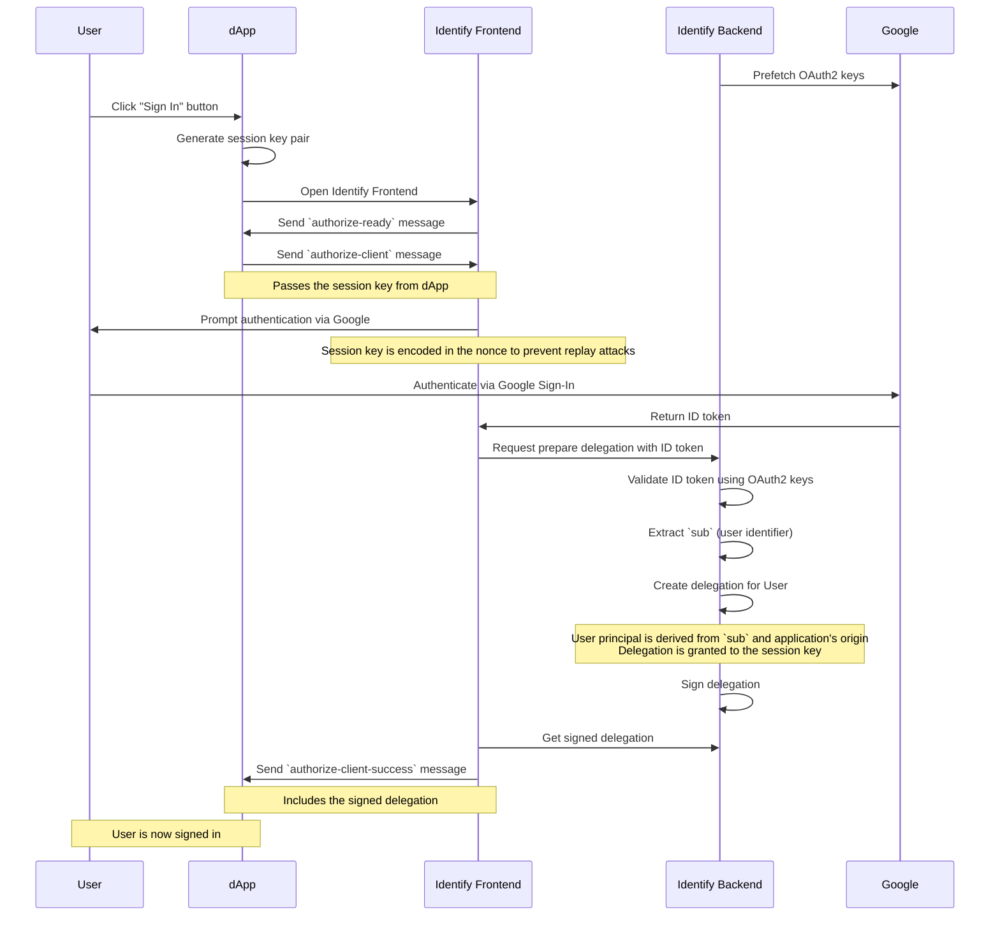

# Identify

Identify is an authentication provider for the Internet Computer, providing an endpoint for the standard authentication client to request Sign In with Google.

It also lets whitelisted apps look up the email address for a specific principal.

# Integration

## Managed setup

To integrate Identify into your own app, you just have to point the auth-client to one of the supported login urls.

- Integrate the auth-client into your app.
- Instead of "identity.ic0.app" point the auth client to one of the public instances of Identify (e.g. "https://login.f0i.de").

## Self deployed

Follow this steps if you want full control over the login process.

- deploy the canister on the IC
- Set up a custom domain. This should be a subdomain where you have control over the "top-level private domain", so you can create a google client id for it.
- Configure the canister to use the client ID
- Periodically update the google public keys
- Follow the same steps as for the section [Managed Setup](#Managed-Setup) to configure the auth-client

# Apps that use Identify

## Bitcoin Gift Cards

https://btc-gift-cards.com

## login.f0i.de

This app shows some basic statistics about how many apps are connected and how many users signed in with Identify.

# Development

## Contribution

You are welcome to submit any issues you have.
For PRs, please contact me in advance.

## Testing

You can run all of the tests using the following commands:

```
npm run test
npm run bench
```

# JSON-RPC

Identify supports [ICRC-25: Signer Interaction](https://github.com/dfinity/wg-identity-authentication/blob/main/topics/icrc_25_signer_interaction_standard.md).
This interface is used by [IdentityKit](http://identitykit.xyz/).

## Implementation status

Currently the following ICRCs are implemented or will be considered for implementation:

- [x] ICRC-25: Signer Interaction
- [x] ICRC-27: Accounts
- [ ] ICRC-28: Trusted Origins
- [x] ICRC-29: ICRC-29: Browser Post Message Transport
- [ ] ICRC-32: Sign Challenge
- [x] ICRC-34: Delegation
- [ ] ICRC-35: Browser-Based Interoperability Framework
- [ ] ICRC-39: Batch Calling
- [x] ICRC-49: Call Canister
- [ ] ICRC-96: Browser Extension Discovery and Transport
- [ ] ICRC-95: Derivation Origin
- [ ] ICRC-112: Batch Call Canister
- [ ] ICRC-114: Validate Batch Call


# Authentication flow

Asside from JSON-RPC calls, Identify supports the authentication flow currently used by [Internet Identity](https://identity.ic0.app/) and the [@dfinity/auth-client](https://www.npmjs.com/package/@dfinity/auth-client) (v2.x.x)

1. **Identify Backend** pre-fetches OAuth2 keys from **Google server**
2. **User** clicks "Sign In" button inside the dApp
3. **dApp** generates a session key pair
4. **dApp** opens **Identify Frontend**
5. **Identify Frontend** sends `authorize-ready` message to **dApp**
6. **dApp** sends `authorize-client` message to **Identify Frontend**
   - Passes the session key from **dApp**
7. **Identify Frontend** prompts **User** to authenticate via **Google**
   - The session key is encoded in the nonce to prevent replay attacks
8. **User** authenticates using **Google Sign-In**
9. **Google** returns an ID token to **Identify Frontend**
10. **Identify Backend** validates the ID token using OAuth2 keys
11. **Identify Backend** extracts the `sub` (user identifier) from the ID token
12. **Identify Backend** creates a delegation for **User**
    - **User** principal is derived from the `sub` and the application's origin (host name)
    - The delegation is granted to the session key
13. **Identify Backend** signs the delegation
14. **Identify Backend** sends the signed delegation to **Identify Frontend**
15. **Identify Frontend** sends `authorize-client-success` message to **dApp**
   - Includes the signed delegation



# Authentication services

The following web2 authentication providers are supported

- [x] Google (JWT from JS SDK)
- [ ] Auth0 (JWT from JS SDK)
- [ ] GitHub (PKCE)
- [ ] X (PKCE)
- [ ] Apple (PKCE + JWT)
- [ ] Microsoft (PKCE + JWT)

## Google

Google authentication is using the [Google Identity Services JavaScript SDK](https://developers.google.com/identity/gsi/web/guides/overview).
This provides the fastest way to get access to the JWT authentication token.

To configure google sign in for a custom domain, you have to create a API client ID and assign your domain to it.
See [Get your Google API client ID](https://developers.google.com/identity/oauth2/web/guides/get-google-api-clientid) in the Google developer docs.

This client ID must be set inside the app configuration.
Currently this has to be done both in the fronend (app.ts -> GSI_CLIENT_ID) and the backend (main.mo -> googleClientIds).

## Auth0

Possibly allows fetching JWT tokens without separate HTTP-outcalls.

https://auth0.com/docs/get-started/authentication-and-authorization-flow/authorization-code-flow-with-proof-key-for-code-exchange-pkce

## GitHub

Github does not support JWT based sign in for users, so PKCE (Proof Key for Code Exchange extension to the OAuth 2.0) must be used.
This requires additional HTTP outcalls from the backend.

https://docs.github.com/en/apps/oauth-apps/building-oauth-apps/authorizing-oauth-apps

## X

https://docs.x.com/resources/fundamentals/authentication/oauth-2-0/authorization-code

## Apple

https://developer.apple.com/documentation/sign_in_with_apple

## Microsoft

https://learn.microsoft.com/azure/active-directory/develop/v2-oauth2-auth-code-flow

## Facebook

https://developers.facebook.com/docs/facebook-login/manually-build-a-login-flow


# Resources and Related projects

- IC interface spec
  - https://internetcomputer.org/docs/references/ic-interface-spec/#authentication
  - https://internetcomputer.org/docs/references/ic-interface-spec/#signatures
- II Spec
  - https://internetcomputer.org/docs/references/ii-spec#client-authentication-protocol
- ICRC-25 and other signer and JSON-RPC related standards
  - https://github.com/dfinity/wg-identity-authentication/blob/main/topics/icrc_25_signer_interaction_standard.md
- PoC JWT Authentication in Rust
  - https://github.com/ilbertt/ic-react-native-jwt-auth
- Sign in with Ethereum
  - https://github.com/spruceid/siwe
- Internet Identity
  - https://github.com/dfinity/internet-identity
- NFID
  - https://github.com/internet-identity-labs/nfid
- IC replica
  - https://github.com/dfinity/ic

