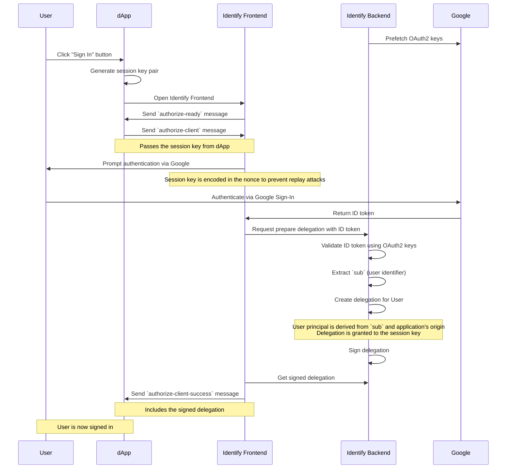

# Identify - Sign in with OAuth2

Identify is an authentication provider for the Internet Computer.

Users can sign in with existing web2 accounts:

- Sign in with OpenID Connect (OIDC/JWT provider)
  - Sign in with Google
  - Sign in with Auth0
  - Sign in with Zitadel
  - Sign in with Apple
  - Sign in with Microsoft
  - Sign in with LinkedIn
  - Sign in with Discord
  - Sign in with Facebook
  - ...
- Sign in with PKCE (generic OAuth2 provider)
  - Sign in with GitHub
  - Sign in with X

Developers can easily integrate Identify into their own apps by useing any of the IC's authentication client libraries.

Dapps can access user information provided by the authentication services, enabling richer user experiences on the Internet Computer.
The available fields include:

- **Username**
- **Email address**
- **Profile picture**
- ...

# Integration

## Managed setup

To integrate Identify into your own app, you just have to point the auth-client to one of the supported login urls.

- Integrate the auth-client into your app.
- Point the auth client to one of the public instances of Identify (e.g. `{identityProvider: "https://login.f0i.de"}`).

For more details for your prefered authentication client see one of the following guides:

- [Use with @dfinity/auth-client](docs/use-with-auth-client.md).
- [Use with ic-use-internet-identity](docs/use-with-ic-use-internet-identity.md).
- [Use with IdentityKit](docs/use-with-identitykit.md).

## Self deployed

Follow this steps if you want full control over the login process.

- deploy the canister on the IC
- Set up a custom domain. This should be a subdomain where you have control over the "top-level private domain", so you can create a google client id for it.
- Configure the canister to use the client ID
- Periodically update the google public keys
- Follow the same steps as for the section [Managed Setup](#Managed-Setup) to configure the auth-client

For more details see the [Self deploy guide](docs/self-deploy.md).

# Apps that use Identify

## Bitcoin Gift Cards

https://btc-gift-cards.com

## login.f0i.de

This app shows some basic statistics about how many apps are connected and how many users signed in with Identify.

# Development

## Contribution

You are welcome to submit any issues you have.
For PRs, please contact me in advance.

## Testing

You can run all of the tests using the following commands:

```
npm run test
npm run bench
```

# JSON-RPC

Identify supports [ICRC-25: Signer Interaction](https://github.com/dfinity/wg-identity-authentication/blob/main/topics/icrc_25_signer_interaction_standard.md).
This interface is used by [IdentityKit](http://identitykit.xyz/).

## Implementation status

Currently the following ICRCs are implemented or will be considered for implementation:

- [x] ICRC-25: Signer Interaction
- [x] ICRC-27: Accounts
- [ ] ICRC-28: Trusted Origins
- [x] ICRC-29: ICRC-29: Browser Post Message Transport
- [ ] ICRC-32: Sign Challenge
- [x] ICRC-34: Delegation
- [ ] ICRC-35: Browser-Based Interoperability Framework
- [ ] ICRC-39: Batch Calling
- [x] ICRC-49: Call Canister
- [ ] ICRC-96: Browser Extension Discovery and Transport
- [ ] ICRC-95: Derivation Origin
- [ ] ICRC-112: Batch Call Canister
- [ ] ICRC-114: Validate Batch Call
- [ ] ICRC-146: Cross Chain JSON-RPC


# Authentication flow

Aside from JSON-RPC calls, Identify supports the authentication flow currently used by [Internet Identity](https://identity.ic0.app/) and the [@dfinity/auth-client](https://www.npmjs.com/package/@dfinity/auth-client) (v2.x.x)

1. **Identify Backend** pre-fetches OAuth2 keys from **Google server**
2. **User** clicks "Sign In" button inside the dApp
3. **dApp** generates a session key pair
4. **dApp** opens **Identify Frontend**
5. **Identify Frontend** sends `authorize-ready` message to **dApp**
6. **dApp** sends `authorize-client` message to **Identify Frontend**
   - Passes the session key from **dApp**
7. **Identify Frontend** prompts **User** to authenticate via **Google**
   - The session key is encoded in the nonce to prevent replay attacks
8. **User** authenticates using **Google Sign-In**
9. **Google** returns an ID token to **Identify Frontend**
10. **Identify Backend** validates the ID token using OAuth2 keys
11. **Identify Backend** extracts the `sub` (user identifier) from the ID token
12. **Identify Backend** creates a delegation for **User**
    - **User** principal is derived from the `sub` and the application's origin (host name)
    - The delegation is granted to the session key
13. **Identify Backend** signs the delegation
14. **Identify Backend** sends the signed delegation to **Identify Frontend**
15. **Identify Frontend** sends `authorize-client-success` message to **dApp**
   - Includes the signed delegation



# Authentication services

The following web2 authentication providers are supported

- [x] Google (JWT from JS SDK / OIDC)
- [x] Auth0 (JWT from JS SDK / OIDC)
- [x] Zitadel (JWT via OIDC)
- [x] GitHub (PKCE)
- [x] X (PKCE)
- [ ] Apple (PKCE + JWT)
- [ ] Microsoft (PKCE + JWT)
- [x] LinkedIn (JWT without nonce)
- [x] Discord (JWT without nonce)

## Google

Google authentication is using the [Google Identity Services JavaScript SDK](https://developers.google.com/identity/gsi/web/guides/overview).
This provides the fastest way to get access to the JWT authentication token.

To configure google sign in for a custom domain, you have to create a API client ID and assign your domain to it.
See [Get your Google API client ID](https://developers.google.com/identity/oauth2/web/guides/get-google-api-clientid) in the Google developer docs.

This client ID must be set inside the app configuration.
Currently this has to be done both in the fronend (app.ts -> GSI_CLIENT_ID) and the backend (main.mo -> googleClientIds).

## Auth0

Possibly allows fetching JWT tokens without separate HTTP-outcalls.

https://auth0.com/docs/get-started/authentication-and-authorization-flow/authorization-code-flow-with-proof-key-for-code-exchange-pkce

## GitHub

GitHub does not support JWT based sign in for users, so PKCE (Proof Key for Code Exchange extension to the OAuth 2.0) must be used.
This requires additional HTTP outcalls from the backend.

Currently there are two security concerns you should be aware of, before using this authentication method:

- HTTP outcalls to exchange the token and retrieve user info can not be replicated (meaning they will only performed by a single node machine), because only the first request is accepted by GitHub.
  The node performing the outcall could manipulate the result and e.g. pretend to sign in an arbitrary user.
- GitHub PKCE flow requires a client_secret to be stored in the backend canister.
  The secret could be extracted from the backend and other sites could impersonate the Identify app.

To summarize, you have to trust that there are no malicious node providers in the subnet.

https://docs.github.com/en/apps/oauth-apps/building-oauth-apps/authorizing-oauth-apps

See [CONSIDERATION](CONSIDERATION.md) for security implications.

## X

X is also using PKCE with HTTP outcalls that can not be replicated.
However PKCE on X does not require a client secret, so there is one less attack vector.

https://docs.x.com/resources/fundamentals/authentication/oauth-2-0/authorization-code

X uses incredibly restrictive limits on all their APIs.
This limits the number of times we can request user info during the sign in process, limiting sign ins to 25 times per day.
See https://docs.x.com/x-api/fundamentals/rate-limits and look for `users/me` to check the current rate limits.

See [GitHub](#GitHub) and [CONSIDERATION](CONSIDERATION.md) for security implications.

## Apple

https://developer.apple.com/documentation/sign_in_with_apple

## Microsoft

https://learn.microsoft.com/azure/active-directory/develop/v2-oauth2-auth-code-flow

## Facebook

https://developers.facebook.com/docs/facebook-login/manually-build-a-login-flow

## LinkedIn

LinkedIn does provide a JWT through OIDC, requires a client secret to get the JWT token.
Storing the client secret requires trust in the node providers.

The JWT does not reflect the provided nonce, which is required to prevent unauthorized reuse.

https://learn.microsoft.com/en-us/linkedin/consumer/integrations/self-serve/sign-in-with-linkedin-v2


Alternatively, Linked in also supports the PKCE flow using a code_verifier, but only for native apps.
PKCE callbacks are limited to loopback interfaces (localhost), and therefore cannot be used for web apps.

https://learn.microsoft.com/en-us/linkedin/shared/authentication/authorization-code-flow-native

See [CONSIDERATION](CONSIDERATION.md) for security implications.

## Discord

Discord authentication uses OAuth2 with JWT tokens, similar to LinkedIn.

https://discord.com/developers/docs/topics/oauth2

See [CONSIDERATION](CONSIDERATION.md) for security implications.

# Resources and Related projects

- IC interface spec
  - https://internetcomputer.org/docs/references/ic-interface-spec/#authentication
  - https://internetcomputer.org/docs/references/ic-interface-spec/#signatures
- II Spec
  - https://internetcomputer.org/docs/references/ii-spec#client-authentication-protocol
- ICRC-25 and other signer and JSON-RPC related standards
  - https://github.com/dfinity/wg-identity-authentication/blob/main/topics/icrc_25_signer_interaction_standard.md
- PoC JWT Authentication in Rust
  - https://github.com/ilbertt/ic-react-native-jwt-auth
- Sign in with Ethereum
  - https://github.com/spruceid/siwe
- Internet Identity
  - https://github.com/dfinity/internet-identity
- NFID
  - https://github.com/internet-identity-labs/nfid
- IC replica
  - https://github.com/dfinity/ic

