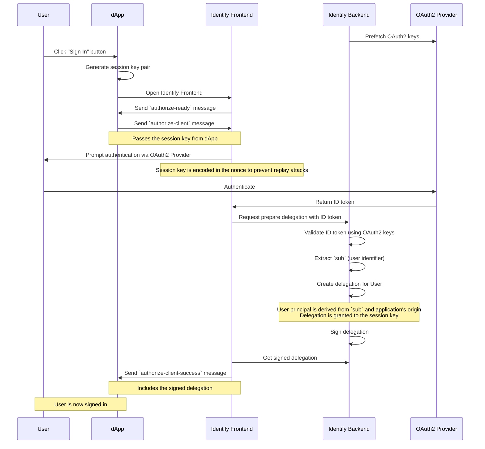

# Introduction to Identify

Identify is an authentication provider for the Internet Computer that enables users to sign in with their existing Web 2.0 accounts. It acts as a on-chain service that connects familiar OAuth2-based login flows to dApps.

By integrating Identify, developers can provide a seamless and familiar onboarding experience, which can significantly lower the barrier to entry for new users. Dapps can also securely access user information like username, email, and profile picture, enabling richer, more personalized user experiences.

## Key Features

*   **Multiple Authentication Providers:** Supports a wide range of popular providers through OIDC (JWT) and PKCE flows.
*   **Easy Integration:** Designed for simple integration with common IC authentication libraries.
*   **Flexible Deployment:** Can be used via a public, managed instance or self-deployed for full control.
*   **User Data Access:** Allows whitelisted dapps to securely retrieve user information.
*   **Standard Compliant:** Implements ICRC-25 for compatibility with tools like IdentityKit.

## Authentication Flow

The following diagram illustrates the standard authentication flow when a user signs into a dapp using Identify.

## Supported Providers

Identify supports providers that use the OpenID Connect (OIDC) and PKCE authentication flows. This includes, but is not limited to:

*   Google
*   Auth0
*   Zitadel
*   GitHub
*   X
*   LinkedIn
*   Discord

## Getting Started

Ready to integrate Identify into your dapp? Choose the path that's right for you:

*   **[Use with @dfinity/auth-client](./use-with-auth-client.md):** The quickest way to get started using a managed public instance.
*   **[Use with ic-use-internet-identity](./use-with-ic-use-internet-identity.md):** For React applications.
*   **[Use with IdentityKit](./use-with-identitykit.md):** For ICRC-25 compatible integration.
*   **[Self-Deploy Identify](./self-deploy.md):** For full control over your authentication flow.
*   **[Configure Providers](./configure-provider.md):** Learn how to configure different OAuth2 providers.
